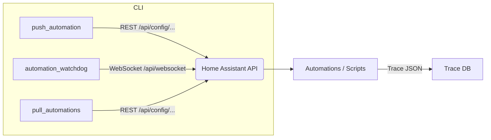

# Home Assistant Tools (ha-tools) Wiki

> *A collection of small, opinionated Python utilities that make life with Home Assistant & YAML automations a little smoother.*

---

## 🚀 Quick Start

```bash
# clone and jump in
git clone https://github.com/apro187/HA-Tools.git && cd HA-Tools

# (optional) create & activate a virtual‑env
python -m venv .venv && source .venv/bin/activate

# install local dependencies
pip install -r requirements.txt

# first run: run the setup script (creates folders and pulls your automations/scripts from Home Assistant)
setup-ha-tools

# after setup, push an automation & reload HA
push-automation --push-file examples/my_automation.yaml --reload
```

> **Tip:** once everything works locally, install with **pipx** so the CLIs are on your `$PATH`: `pipx install --editable .`

---

## 📂 Repository Layout

| Path                  | Purpose                               |
| --------------------- | ------------------------------------- |
| `src/`                | All CLI scripts & helpers             |
| `examples/`           | Sample YAML/JSON you can test against |
| `.vscode/launch.json` | Handy debug profiles                  |
| `tests/`              | Pytest suite (work‑in‑progress)       |

---

## 🛠️ Tool Reference

Each script has its own page with **overview → arguments → examples → Home Assistant recipe → troubleshooting**. Click through or use the sidebar.

| Script                         | Purpose                                                | Wiki page                        |
| ------------------------------ | ------------------------------------------------------ | -------------------------------- |
| `push_automation.py`           | Push a local YAML automation to HA & optionally reload | [[push_automation]]              |
| `pull_automations.py`          | Pull automations/scripts from HA                       | [[pull_automations]]             |
| `automation_watchdog.py`       | Tails HA trace logs, alerts when a run fails           | [[automation_watchdog]]          |
| `get_ha_entities.py`           | Dump entity list to CSV/Markdown                       | [[get_ha_entities]]              |
| `get_recent_trace_errors.py`   | Find scripts/automations that blew up recently         | [[get_recent_trace_errors]]      |
| `generate_entity_state_doc.py` | Snapshot current states into a doc                     | [[generate_entity_state_doc]]    |

> **Adding a new script?**  Copy the template at the bottom of this page → rename → add a row here so it shows up.

---

## 🔄 Typical Workflows

1. **Pull changes from HA:** `pull-automations`
2.  **Edit YAML locally** → `push_automation.py --auto-detect-changes` → HA reloads → success / error notification via **automation_watchdog.py**.
3.  **Nightly cron** runs `get_recent_trace_errors.py` and emails you the failures from the past 24 h.
4.  **Documentation refresh**: `generate_entity_state_doc.py --md docs/entities.md` before a big refactor.

---

## 🧩 Architecture at a Glance



---

## 🔐 Configuration & Initial Pull

- By default: `config/config.json` in your `~/Documents/HA-Tools` directory
- Or as set by the `HA_TOOLS_CONFIG_BASE` environment variable
- Never in the repo/project folder

**Setup script features:**
- Prompts for your Home Assistant URL, token, and preferred folders
- Creates the folders (`config/`, `automations/`, `scripts/`, `logs/`) if they don't exist
- After setup, automatically pulls all automations and scripts from your Home Assistant instance and saves them locally
- All fields are set by the setup script and can be updated by re-running it

**Config file structure:**
The `config.json` file is a simple JSON object with the following keys:

```json
{
  "HA_URL": "<your Home Assistant URL>",
  "HA_TOKEN": "<your long-lived access token>",
  "HA_PATH": "<path to your Home Assistant config directory>",
  "AUTOMATIONS_DIR": "<path to your automations directory>",
  "SCRIPTS_DIR": "<path to your scripts directory>",
  "LOGS_DIR": "<path to your logs directory>",
  "PRINTS_DIR": "<path to your prints directory>"
}
```
---

---

## ❓ Troubleshooting & FAQ

| Symptom                                  | Likely Cause                      | Fix                                                        |
| ---------------------------------------- | --------------------------------- | ---------------------------------------------------------- |
| `401 Unauthorized` when calling API      | Wrong long‑lived access token     | Create a new token in HA → update `HA_TOOLS_TOKEN` env var |
| `400 Bad Request` pushing YAML           | YAML did not pass HA config‑check | Run `ha core check` locally; fix linting errors            |
| Nothing happens when watchdog is running | Your HA event stream is quiet     | Trigger an automation manually to test                     |

---

## 🤝 Contributing (future‑proofing)

- **Linting**: `ruff check src tests`
- **Commits**: Conventional Commits (`feat:`, `fix:`…)
- **CI**: planned GitHub Action to run tests + publish wiki.

---

# TEMPLATE_script_page.md

> Copy → rename to the script’s filename (minus `.py`) when adding a new page.

````markdown
# {script_name}.py

## Overview
Brief one‑liner explaining _what problem this solves_.

## Usage
```bash
python src/{script_name}.py [OPTIONS]
```

| Option     | Type | Default                           | Description                  |
| ---------- | ---- | --------------------------------- | ---------------------------- |
| `--ha-url` | str  | `http://homeassistant.local:8123` | Base URL of your HA instance |
| `--token`  | str  | env `HA_TOOLS_TOKEN`              | Long‑lived access token      |
| …          |      |                                   |                              |

> Tip: run `python src/{script_name}.py --help` to see the full list.

## Example

```bash
python src/{script_name}.py --some-flag value
```

### Sample output

```
<terminal output here>
```

## Home Assistant automation/snippet

```yaml
alias: Example that calls {script_name}
mode: single
trigger:
  - platform: state
    entity_id: binary_sensor.front_door
    to: 'on'
action:
  - service: python_script.{script_name}
```

## Troubleshooting

| Error | Hint |
| ----- | ---- |
| …     | …    |

---

## Changelog

- **v0.1** – initial version

```

---

# How to Publish These Pages Automatically

1. Keep all wiki Markdown inside `docs/wiki_src/` in the repo.  
2. Add a GitHub Action that, on `main`, copies the folder to `gh-pages` → pushes to the Wiki using a bot token.  
3. Or keep your existing shell script – the folder structure above will still work.

---

*Last updated: July 5, 2025*
